# SaaS Dashboard

A full-stack SaaS dashboard with real-time data, role-based access control, and live activity tracking. Built with React, Node.js, and Supabase.

🔗 **Live Demo:** https://saasdashboarddemo.netlify.app/login

## Demo Accounts

| Role  | Email           | Password |
|-------|-----------------|----------|
| ADMIN | admin@demo.com  | admin    |
| USER  | user@demo.com   | user     |

> Note: These accounts are for demo purposes only.

## Features

### Admin
- **Real-time dashboard** — KPI cards, charts, and invoice table update instantly without page refresh
- **Live activity feed** — WebSocket-powered feed showing every create, update, and delete across the app as it happens
- **Data visualization** — Revenue over time (line chart), invoices per user (bar chart), revenue distribution (donut chart)
- **Full CRUD** — manage products, invoices, and users
- **Audit logging** — every mutation is logged to the database and broadcast via Supabase Realtime
- **Role management** — promote or demote users between Admin and User roles

### User
- **Personal dashboard** — spending over time (line chart), invoice status breakdown (donut chart)
- **Invoice history** — view and track personal invoices with Paid/Pending/Overdue status
- **KPI cards** — total invoices, total spent, paid invoices count, last activity

### General
- JWT authentication with bcrypt password hashing
- Role-based access control (Admin/User) with protected routes
- Fully responsive — works on mobile and desktop
- Dark theme with Framer Motion animations
- Internationalization (English / Greek)

## Tech Stack

| Layer | Technology |
|-------|------------|
| Frontend | React, TypeScript, Vite, Tailwind CSS |
| Backend | Node.js, Express, Prisma ORM |
| Database | PostgreSQL (Supabase) |
| Realtime | Supabase Realtime (WebSockets) |
| Auth | JWT, bcrypt |
| Charts | Recharts |
| Animations | Framer Motion |
| Deployment | Netlify (frontend), Vercel (backend) |

## Architecture
```
Browser (React + Supabase JS)
    ↕ HTTP (Axios)          ↕ WebSocket (Supabase Realtime)
Express API (Node.js)        Supabase
    ↕ Prisma ORM
PostgreSQL (Supabase)
```

## Getting Started

### Prerequisites
- Node.js 18+
- A Supabase project
- PostgreSQL database

### Backend
```bash
cd backend
npm install
cp .env.example .env  # fill in your credentials
npx prisma migrate dev
npm run dev
```

### Frontend
```bash
cd frontend
npm install
cp .env.example .env  # fill in your credentials
npm run dev
```

### Environment Variables

**Backend `.env`:**
```
DATABASE_URL=
DIRECT_URL=
JWT_SECRET=
```

**Frontend `.env`:**
```
VITE_API_BASE_URL=
VITE_SUPABASE_URL=
VITE_SUPABASE_ANON_KEY=
```

## Screenshots

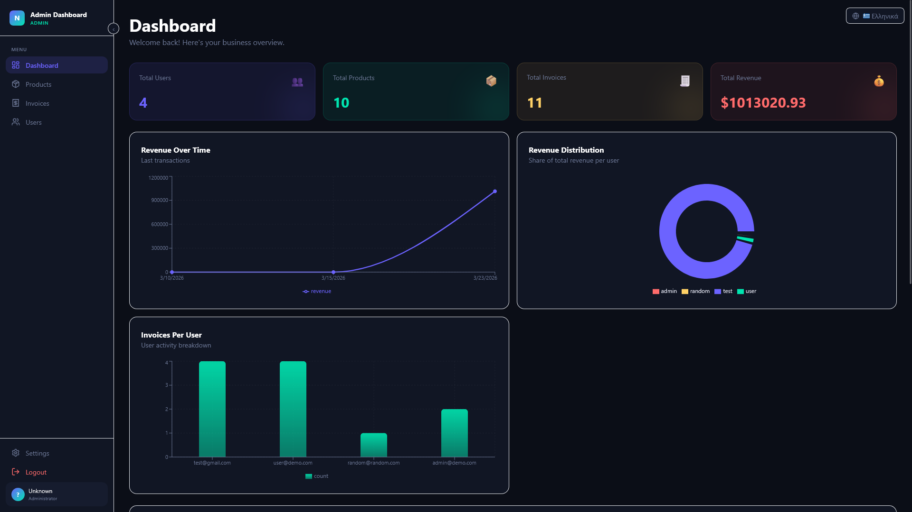

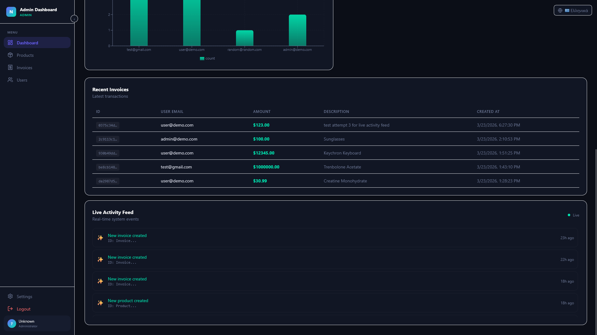

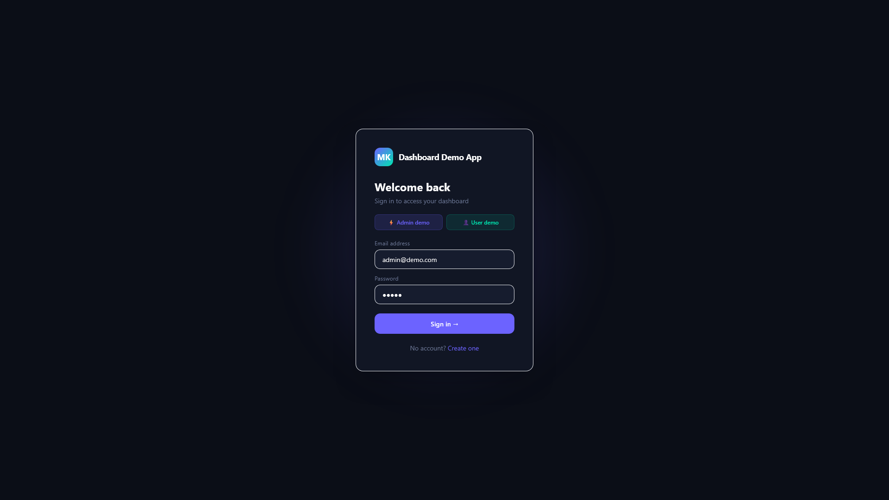

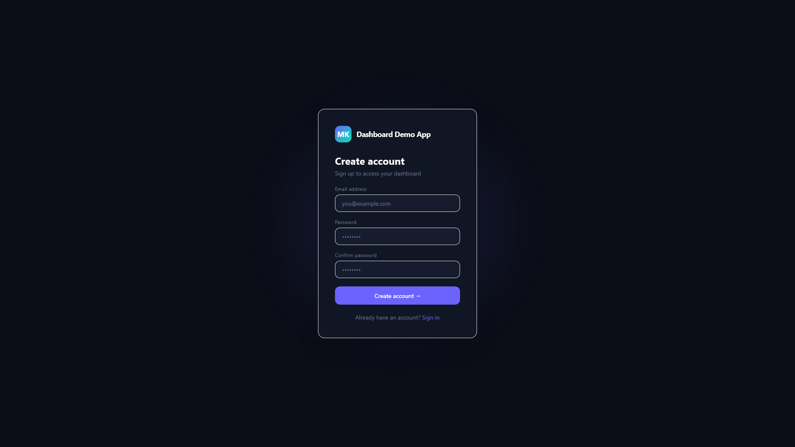

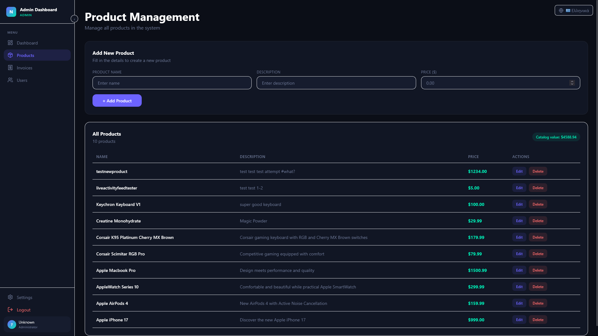

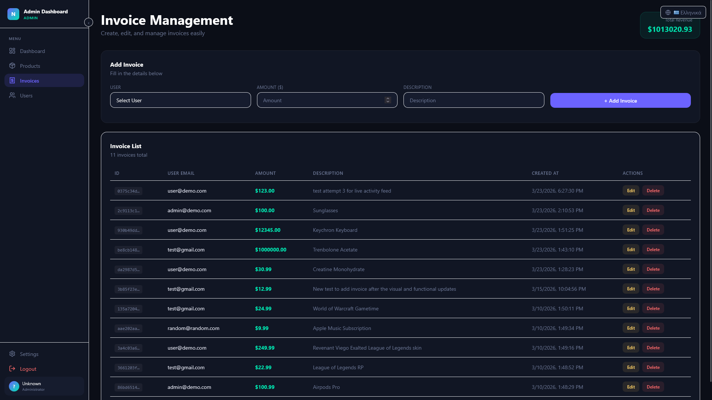

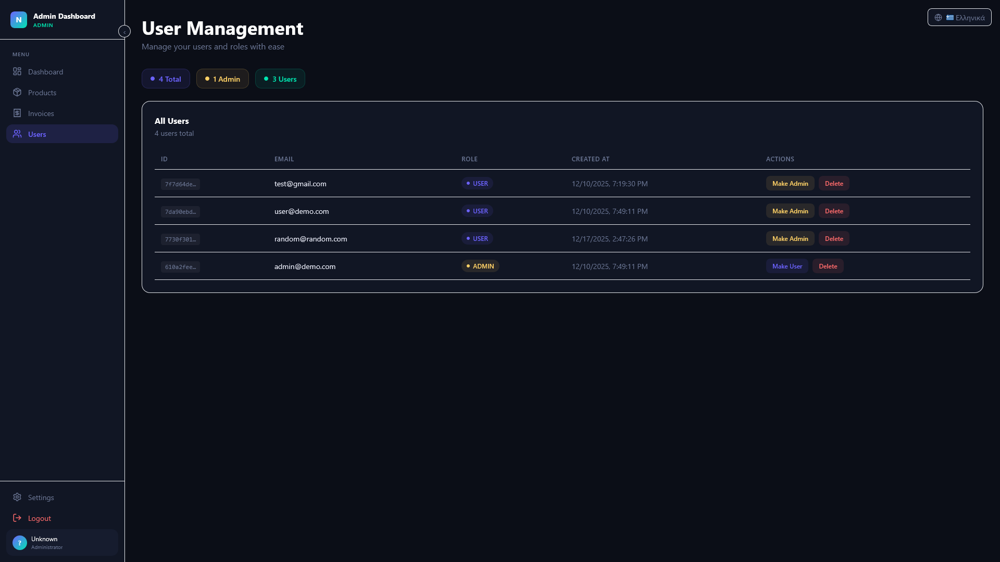

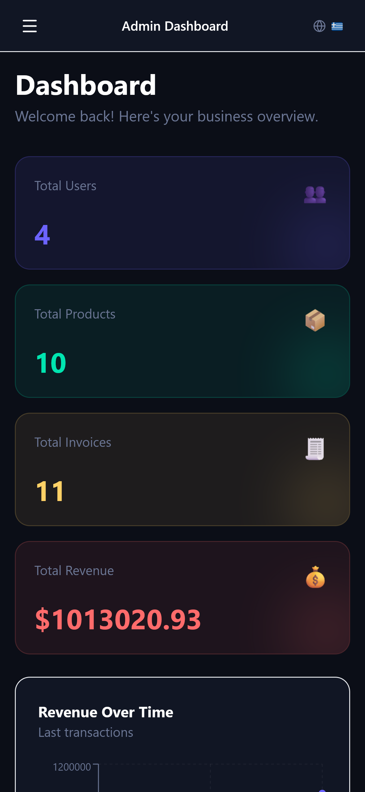

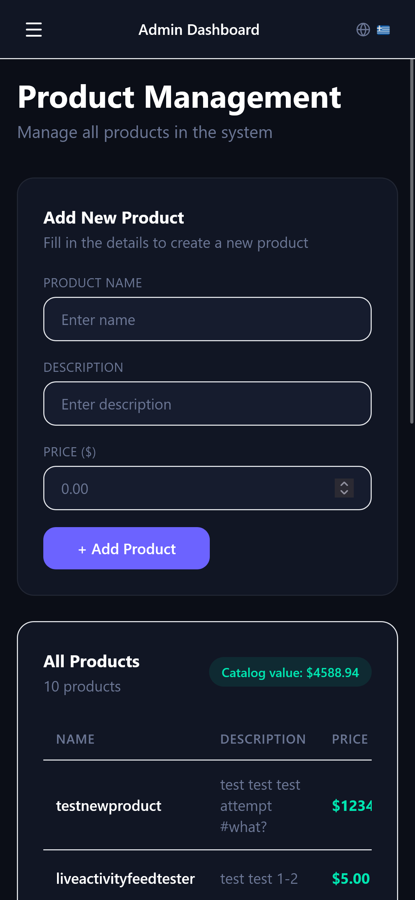

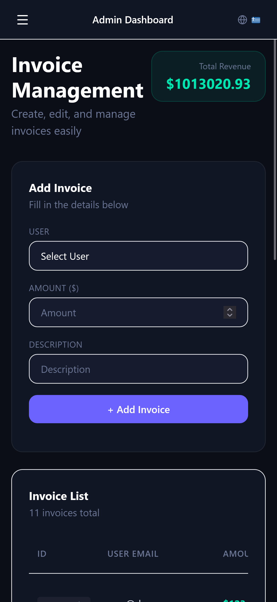

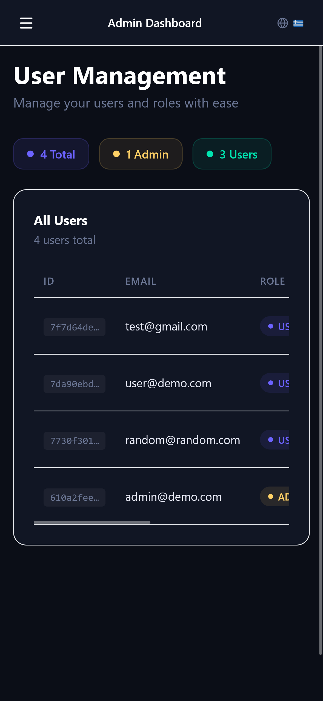